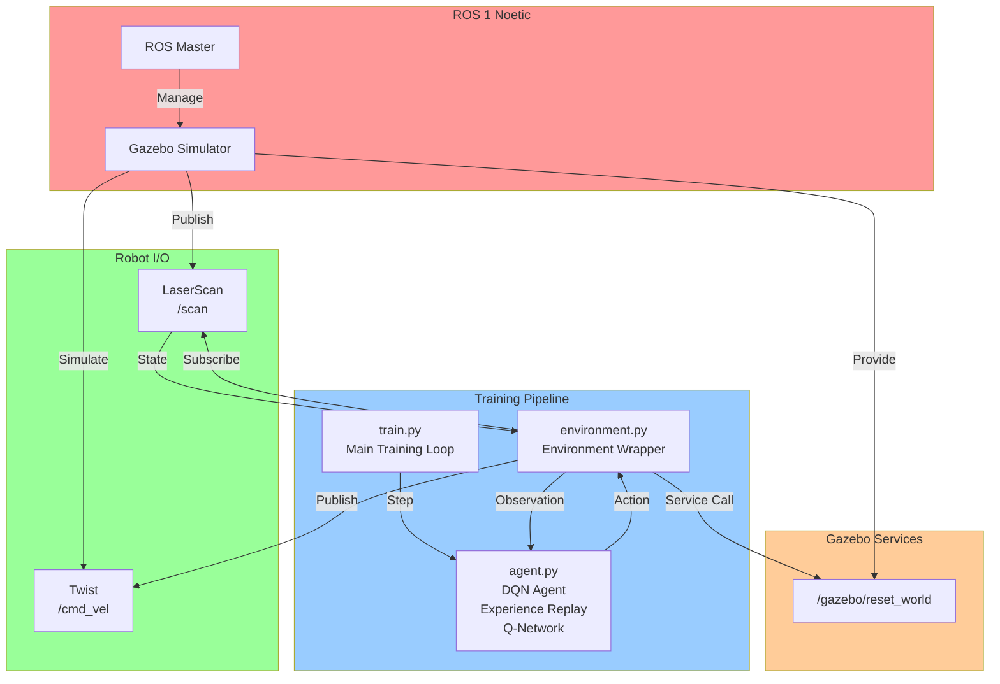

# Q-Learning Navigation for TurtleBot3

A ROS 1 Noetic-based reinforcement learning project for training a TurtleBot3 to navigate and avoid obstacles using Deep Q-Networks (DQN) in a Gazebo simulation environment.

## System Architecture



## Project Structure

- **`train.py`** - Main training script that orchestrates the learning loop
- **`agent.py`** - DQN agent implementation with experience replay and Q-network
- **`environment.py`** - Environment wrapper that interfaces with Gazebo and ROS
- **`save_model/`** - Directory for saving trained model weights
- **`training_data.txt`** - Training metrics and logs

## Key Features

- **Deep Q-Network (DQN)**: Neural network-based Q-learning with experience replay
- **Obstacle Avoidance**: LiDAR-based state discretization into 5 sectors
- **Gazebo Simulation**: Physics-accurate simulation with TurtleBot3
- **ROS Integration**: Full ROS 1 Noetic compatibility
- **Reward Shaping**: Dynamic rewards encouraging safe navigation

## Dependencies

### ROS
- `rospy`
- `geometry_msgs`
- `sensor_msgs`
- `std_srvs`

### Python
- `numpy`
- `tensorflow` / `keras`
- `matplotlib`

## Setup Instructions

### Prerequisites
```bash
# Install ROS Noetic and TurtleBot3 simulation packages
sudo apt install ros-noetic-gazebo-ros
sudo apt install ros-noetic-turtlebot3-*
```

### Environment Variables
```bash
export TURTLEBOT3_MODEL=burger
export GAZEBO_MODEL_PATH=$GAZEBO_MODEL_PATH:/opt/ros/noetic/share/turtlebot3_gazebo/models
```

### Installation
```bash
cd ~/catkin_ws
catkin_make
source devel/setup.bash
```

## Usage

### Training
```bash
rosrun q_learning_nav train.py
```

This will:
1. Launch Gazebo with the TurtleBot3 environment
2. Train the DQN agent for multiple episodes
3. Save model checkpoints to `save_model/`
4. Log training metrics to `training_data.txt`

### Plotting Results
```bash
./plot_learning_curve.py
```

## Algorithm Details

### State Representation
The environment discretizes LiDAR data into 5 sectors:
- **Front**: Narrow cone crossing 0°
- **Left-Front**: Left-forward quadrant
- **Left**: Left side
- **Right**: Right side
- **Right-Front**: Right-forward quadrant

### Action Space
- **0**: Turn Left (ω = 1.0 rad/s)
- **1**: Go Straight (ω = 0.0 rad/s)
- **2**: Turn Right (ω = -1.0 rad/s)

Forward linear velocity is constant at 0.15 m/s.

### Reward Structure
- **Collision** (distance < 0.2m): -50 penalty
- **Safe Navigation**: 1.0 + (min_distance - 0.5) to encourage mid-hallway navigation

## Troubleshooting

### Silent Exit After First Episode
If the training exits silently after the first episode, check that the Gazebo reset service is using `/gazebo/reset_world` instead of `/gazebo/reset_simulation`. The latter resets the ROS clock which causes issues.

### Gazebo Connection Issues
Ensure the ROS Master is running:
```bash
roscore
```

In another terminal:
```bash
roslaunch gazebo_ros empty_world.launch
```

## License

MIT
